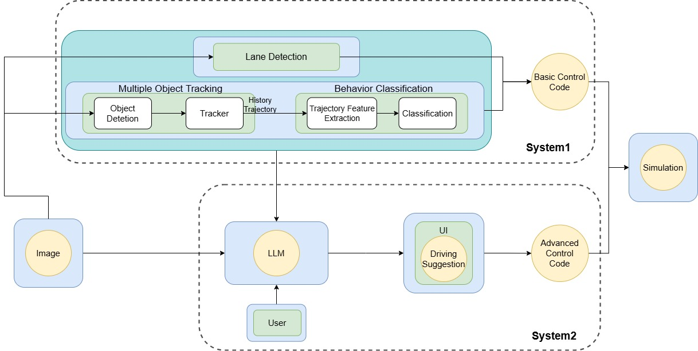
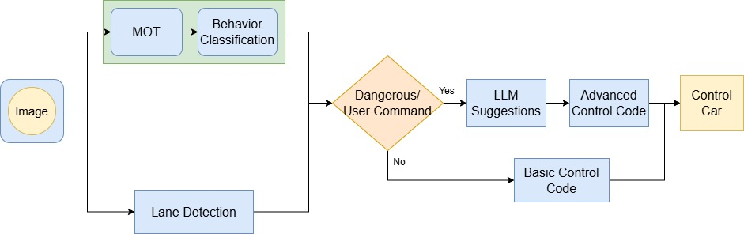

# FastSlowDrive

本專案是一套整合多種模組的智慧自駕系統，具備以下功能：
- 車輛與行人偵測與追蹤（YOLOv10 + ByteTrack）
- 車道線偵測與偏移控制（UFLD_v2 + PID 控制）
- 危險行為辨識（Social LSTM 軌跡分析 + ROI預警區域）
- 語意駕駛建議生成（OpenAI GPT4o）
- 支援 CARLA 模擬平台進行場景測試

## 📌 系統架構
<p align="center">
  
</p>

本系統架構劃分為兩個主要子系統，分別負責感知控制與語意判斷：

- **System 1：感知與基本控制模組**
  - 接收來自模擬環境的即時影像，執行：
    - `Object Detection` + `Multiple Object Tracking`（YOLOv10 + ByteTrack）
    - `Lane Detection`（UFLD_v2 車道線偵測）
    - `Behavior Classification`（Social-LSTM 軌跡分析 + 危險區域判定）
  - 若未偵測到潛在風險，系統輸出 `Basic Control Code`，控制模擬車輛執行常規駕駛任務。

- **System 2：語意推理與進階控制模組**
  - 若行為分類結果顯示存在風險，或接收到使用者指令，將啟動 `LLM`（大型語言模型）。
  - LLM 模型接收影像後產生具語意的風險判斷與駕駛建議，經由 `UI` 顯示並轉換為 `Advanced Control Code`，送至模擬環境執行控制行為。

> 本架構結合 rule-based 與 LLM-based 控制策略，在保障安全性的同時引入語意理解能力。


## 📌 運作流程
<p align="center">
  
</p>

1. **輸入影像** 同時進入：
   - `MOT`（多目標追蹤）與 `Behavior Classification`（行為分類）
   - `Lane Detection`（車道線偵測）

2. 系統判斷是否偵測到：
   - 危險行為（根據軌跡分類）
   - 或使用者下達控制指令

3. 若為「Yes」：
   - 啟動 `LLM Suggestions`，由語言模型輸出場景分析與控制建議
   - 控制策略改為使用 `Advanced Control Code`

4. 若為「No」：
   - 系統執行 `Basic Control Code`

5. 所有控制邏輯皆最終傳遞給模擬器進行行車操作。

> 該流程平衡了即時性與語意能力，在風險場景中展現語言模型輔助決策的潛力。


## 🔧 專案目錄結構

| 檔案 / 資料夾        | 功能說明 |
|---------------------|----------|
| `main.py`        | 系統主程式：整合感知、追蹤、控制、LLM 觸發 |
| `gui_app.py`        | 互動式 UI（選用） |
| `autopilot_fun/perception.py`     | 感知模組：多物件追蹤 + 車道線偵測 |
| `autopilot_fun/utils.py`          | 輔助函式：視窗截圖、危險區域推估、計時器等 |
| `autopilot_fun/visualization.py`  | 畫面渲染：軌跡繪製、車道線、風險區域顯示 |
| `autopilot_fun/control.py`        | 控制模組：PID 控制器、避障邏輯、車道維持 |
| `autopilot_fun/integration.py`    | GPT 模型整合：提示詞設計、API 呼叫與回應處理 |
| `TrajectoryClassification/social_lstm_trainer.py` | 行為分類：Social-LSTM 模型進行軌跡分析 |
| `UFLD` | 車道線偵測 |


- Python >= 3.7
- [YOLOv10](https://github.com/ultralytics/ultralytics)
- [UFLD_v2 車道線偵測](https://github.com/cfzd/Ultra-Fast-Lane-Detection-v2)
- OpenAI API 金鑰
- [CARLA Simulator](https://carla.org/) 版本 0.9.13
- 其他套件詳見 `requirements.txt`

## 🚀 執行方式
### 1. 啟動 CARLA 模擬器: 
詳細安裝與設定請參考：[CARLA README](CARLA/README.md)

### 2. 執行主程式：

#### 🖥️ GUI 互動模式執行
```bash
python gui_app.py
```

#### ⚡ 命令列模式執行
```bash
python main.py --config UFLD/configs/culane_res18.py --test_model UFLD/weights/culane_res18.pth --save_result --window_name "pygame"
```

## 📊 實驗結果

<table>
  <tr>
    <td align="center">
      
      <br>
      <b>system1</b>
    </td>
    <td align="center">
      
      <br>
      <b>system1+2</b>
    </td>
  </tr>
</table>

